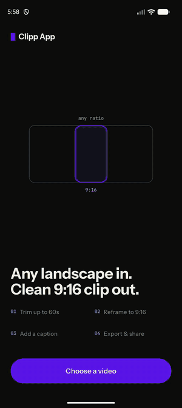

# Clipp App

A landscape-video clipper: pick a video, trim it to at most 60 seconds, add a
one-line caption, and export a clean 16:9 clip with the caption burned in.

## Demo

<p align="center">
  
</p>

Screen recording on an Android emulator: pick a video, drag the trim handles
(the preview follows the handle), add a caption, export. Full-quality version:
[`docs/demo.mp4`](docs/demo.mp4).

## Download & Install

_APK link pending — will be added here once available._

Download the APK, install it on an Android device, and start testing the app.

## How to Run from Source

```bash
flutter pub get
flutter test
flutter run
```

Built with **Flutter 3.47.5** (Dart 3.13.4). Any recent stable Flutter
install matching `environment.sdk: ^3.13.4` in `pubspec.yaml` should work.

**Android setup**: no extra steps beyond a normal Flutter install — `minSdk`
is 24 (Android 7.0+), handled automatically by Gradle. A physical device or
emulator with a photo library is needed to pick and save videos.

## App Flow

1. Pick a landscape video
2. Select start and end time
3. Maximum clip duration: 60 seconds
4. Add a one-line caption
5. Reframe to 16:9 (crop, not stretch)
6. Burn the caption into the video
7. Preview the result
8. Save or share

## Video Processing

Video processing runs **on-device using FFmpeg** — there is no backend or
server involved.

**Why:**
- No backend/server required
- Simpler architecture for the scope of this assignment
- The user's video never leaves the device
- Sufficient for a single-device, single-user take-home scope

**Trade-off:** processing performance depends entirely on the device, and it
consumes CPU, memory, battery, and storage while running.

## Architecture

- **Flutter**, single-feature app
- **Clean Architecture** — domain (entities, use cases, repository
  interface) → data (models, datasources, repository impl) → presentation
  (state, ViewModel, screens/widgets)
- **MVVM** — a `ChangeNotifier` ViewModel exposes immutable state; screens
  only read/call the ViewModel, never the use cases or FFmpeg directly
- **Feature-first** folder structure (`lib/features/video_clipping/...`)
- Video processing (FFmpeg), the picker, gallery save, and share are each
  isolated behind a `VideoRepository` interface, so the domain layer has no
  dependency on Flutter, FFmpeg, or platform plugins

## Trade-offs

| Decision             | Why                             | Trade-off                        |
| --------------------- | -------------------------------- | --------------------------------- |
| On-device processing | Simple and no backend required  | Depends on device performance    |
| FFmpeg               | Powerful video processing       | Adds a native dependency         |
| Flutter              | Fast cross-platform development | Some native integration required |
| Local processing     | Keeps videos on the device      | Limited by device resources      |

## Testing

```bash
flutter analyze
flutter test
```

- **Start/end validation, max 60s cap, clip duration calculation** —
  `test/features/video_clipping/domain/usecases/validate_clip_test.dart`
- **Caption validation, use case orchestration** —
  `test/features/video_clipping/domain/usecases/process_video_test.dart`
- **ViewModel/state transitions** (wizard step navigation, duplicate-submit
  guard, cancel-without-error-banner) —
  `test/features/video_clipping/presentation/viewmodels/video_clipping_viewmodel_test.dart`
- **Widget states** (pick CTA, error snackbar, navigation on success) —
  `test/features/video_clipping/presentation/screens/video_home_screen_test.dart`
- **Core utilities** (`Result`/`Failure`, duration formatting) —
  `test/core/`

Not unit tested: the FFmpeg and image-picker datasources themselves — they're
thin wrappers around native plugins that need a real device to execute
meaningfully. Every business rule they touch (max duration, caption length)
is already covered at the use-case layer above them.

## Next Steps

- Processing progress that reflects true FFmpeg pass count
- Cancel processing mid-export
- Better timeline editing (multi-segment trim)
- Background processing (export while app is backgrounded)
- Video compression / quality-vs-size options
- More integration tests
- Analytics / crash monitoring
- Server-side processing for heavier workloads

## AI Tools Used

AI tools were used as an engineering assistant for boilerplate generation,
exploring implementation options, debugging, test generation, and
documentation. The final architecture, implementation decisions, business
rules, testing, and code were reviewed and validated manually.

## Demo Video

_Demo video link pending — will be added here once available._

The demo shows:

1. Pick landscape video
2. Set start/end
3. Add caption
4. Process video
5. Show 16:9 output
6. Show burned-in caption
7. Save/share result
